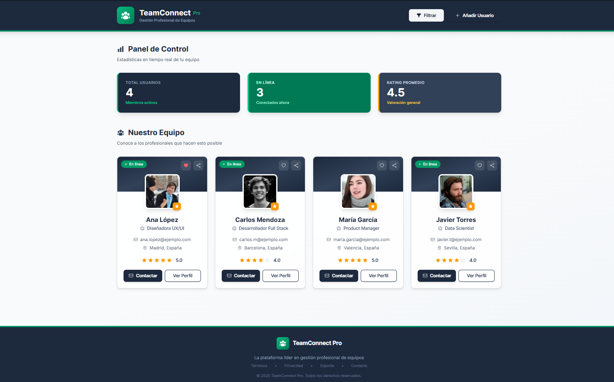

# 🚀 TeamConnect Pro - Sistema de Gestión de Equipos


> 💼 Plataforma profesional para la gestión y visualización de equipos de trabajo con interfaz moderna y funcional.


---

## 📖 Descripción

**TeamConnect Pro** es una aplicación web desarrollada con Next.js que permite gestionar y visualizar perfiles de usuarios de forma profesional. El proyecto fue desarrollado como parte del **Laboratorio 11** del curso de Desarrollo Web, enfocándose en la creación de interfaces modernas con React, componentes reutilizables y diseño corporativo.

### ✨ Características Principales

- 🎨 **Diseño Moderno y Profesional**: Interfaz limpia con paleta de colores corporativa (Slate & Emerald)
- 📱 **Totalmente Responsivo**: Adaptable a dispositivos móviles, tablets y desktop
- 🔄 **Componentes Reutilizables**: Arquitectura modular con React components
- 🎯 **Interactividad Completa**: Filtros, favoritos, compartir perfiles y más
- 🎭 **Animaciones Suaves**: Efectos hover, transiciones y CSS Modules
- 🏷️ **Identidad de Marca**: Logo, tipografía y elementos corporativos consistentes
- ⚡ **Optimizado**: Built con Next.js 15 para máximo rendimiento

---

## 🛠️ Tecnologías Utilizadas

| Tecnología | Uso |
|------------|-----|
| **Next.js 15** | Framework principal de React |
| **React 18** | Librería de UI con hooks |
| **TypeScript** | Tipado estático y mejor DX |
| **TailwindCSS** | Estilos utility-first |
| **CSS Modules** | Animaciones y estilos específicos |
| **Heroicons** | Iconografía profesional |

---

## 📦 Instalación

### Requisitos Previos

- Node.js (v18 o superior)
- npm o yarn
- Git

### Pasos de Instalación
```bash
# 1. Clonar el repositorio
git clone https://github.com/alexisss13/Lab11-node.git

# 2. Navegar al directorio
cd Lab11-node

# 3. Instalar dependencias
npm install
# o
yarn install

# 4. Ejecutar en modo desarrollo
npm run dev
# o
yarn dev

# 5. Abrir en el navegador
# http://localhost:3000
```

---

## 🎯 Estructura del Proyecto
```
Lab11-node/
├── app/
│   ├── page.tsx          # Página principal
│   ├── layout.tsx        # Layout global
│   └── globals.css       # Estilos globales
├── components/
│   ├── UserCard.tsx      # Componente de tarjeta de usuario
│   ├── UserCard.module.css
│   ├── Button.tsx        # Componente de botón reutilizable
│   └── CardContainer.tsx # Wrapper con props.children
├── public/               # Recursos estáticos
└── package.json          # Dependencias del proyecto
```

---

## 🎨 Componentes Principales

### 1️⃣ **UserCard**
Tarjeta de perfil de usuario con información completa.

**Características:**
- Avatar con efecto hover
- Indicador de estado en línea (pulse animation)
- Sistema de rating con estrellas
- Botones de acción (Contactar, Ver Perfil)
- Favoritos y compartir

**Props:**
```typescript
interface UserCardProps {
  name: string;
  email: string;
  image: string;
  role: string;
  location: string;
  rating: number;
  isOnline: boolean;
  isFavorite?: boolean;
  onToggleFavorite?: () => void;
  onShare?: () => void;
  onContact?: () => void;
  onViewProfile?: () => void;
}
```

### 2️⃣ **Button**
Componente de botón altamente personalizable.

**Variantes:**
- `primary` - Botón principal (slate)
- `secondary` - Botón secundario (gris)
- `success` - Botón de éxito (verde)
- `danger` - Botón de peligro (rojo)
- `outline` - Botón con borde

**Tamaños:** `sm`, `md`, `lg`

### 3️⃣ **CardContainer**
Contenedor genérico usando `props.children`.
```tsx
<CardContainer className="custom-class">
  {/* Cualquier contenido */}
</CardContainer>
```

---

## 💡 Funcionalidades Implementadas

### 🔍 Filtrado Dinámico
- Filtrar usuarios por estado "En línea"
- Actualización en tiempo real del contador

### ❤️ Sistema de Favoritos
- Marcar/desmarcar usuarios favoritos
- Cambio visual del icono (outline → solid)

### 📤 Compartir Perfiles
- Usar API nativa de compartir del navegador
- Fallback: copiar al portapapeles

### 📧 Contacto Directo
- Abrir cliente de email con mailto:
- Dirección pre-rellenada

### 📊 Panel de Control
- Total de usuarios
- Usuarios en línea
- Rating promedio calculado dinámicamente

### 🎭 Animaciones y Efectos
- Hover en tarjetas (scale)
- Pulse animation en indicador online
- Transiciones suaves en todos los elementos
- Efecto backdrop-blur en modales

---

## 🎨 Paleta de Colores

| Color | Uso | Código Hex |
|-------|-----|------------|
| **Slate 800** | Principal/Header | `#1e293b` |
| **Emerald 600** | Acento/Marca | `#059669` |
| **Amber 500** | Ratings | `#f59e0b` |
| **Gray 50** | Background | `#f9fafb` |
| **White** | Tarjetas | `#ffffff` |

---

## 📸 Screenshots

### Vista Principal


---

## 🧪 Pruebas

Para probar todas las funcionalidades:

1. **Filtro**: Click en "Filtrar" para ver solo usuarios en línea
2. **Favoritos**: Click en el corazón de cualquier tarjeta
3. **Compartir**: Click en el icono de compartir
4. **Contactar**: Click en "Contactar" para abrir email
5. **Ver Perfil**: Click en "Ver Perfil" para más información
6. **Modal**: Click en "Añadir Usuario"

---

## 📚 Aprendizajes Clave

Durante el desarrollo de este proyecto aprendí:

✅ **Componentes Modulares**: Crear componentes reutilizables en React  
✅ **Props.children**: Patrón de composición para wrappers  
✅ **TailwindCSS**: Utility-first CSS para estilos rápidos  
✅ **CSS Modules**: Estilos encapsulados y animaciones  
✅ **TypeScript**: Interfaces y tipado para mejor DX  
✅ **Hooks**: useState para manejo de estado local  
✅ **Heroicons**: Integración de iconografía profesional  
✅ **Next.js**: App Router y estructura de proyecto  

---

## 🚀 Mejoras Futuras

- [ ] Backend con API REST
- [ ] Base de datos (PostgreSQL)
- [ ] Autenticación de usuarios
- [ ] Sistema de búsqueda
- [ ] Paginación de usuarios
- [ ] Modo oscuro/claro
- [ ] Tests unitarios (Jest/RTL)
- [ ] Deploy en Vercel

---

## 👨‍💻 Autor

**Alexis Jaren Levano Dominguez**  
Grupo: 5° C24  
Laboratorio 11 - Desarrollo Web

---

## 📄 Licencia

Este proyecto fue desarrollado con fines educativos como parte del curso de Desarrollo Web.

---

## 🤝 Contribuciones

Las contribuciones son bienvenidas. Para cambios importantes:

1. Fork el proyecto
2. Crea una rama (`git checkout -b feature/AmazingFeature`)
3. Commit cambios (`git commit -m 'Add: nueva característica'`)
4. Push a la rama (`git push origin feature/AmazingFeature`)
5. Abre un Pull Request

---

## 📞 Contacto

¿Preguntas o sugerencias? 

- GitHub: [@alexisss13](https://github.com/alexisss13)
- Proyecto: [Lab11-node](https://github.com/alexisss13/Lab11-node)

---

<div align="center">

**⭐ Si te gustó este proyecto, no olvides dejar una estrella ⭐**

Hecho con ❤️ y ☕ por Alexis Levano

</div>